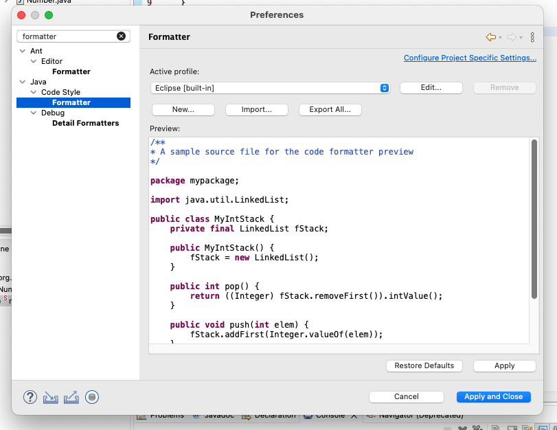

## USTRA HR JAVA 코딩 스타일 가이드

### 코드 스타일 포맷터

* 네이버의 [캠퍼스 핵데이 Java 코딩 컨벤션](https://naver.github.io/hackday-conventions-java/) 포맷터를 적용한다.
* [포맷터 다운로드](https://github.com/naver/hackday-conventions-java/tree/master/rule-config) 에서 각자 개발 IDE에 해당하는 formatter를
  다운받아 적용한다.

1. IntelliJ 포맷터 적용방법
    * 위 링크에서 IntelliJ용 XML 포맷터를 다운로드 받는다.
    * Settings > Editor > Code Style 로 간다.
    * Scheme 우측 톱니바퀴 > Import Scheme > IntelliJ IDEA code style XML 클릭
      
    * 다운로드 받은 XML 포맷터를 찾아 OK를 누른다.
    * 단축키
        * 윈도우 : Ctrl + Alt + L
        * 맥 : Cmd + Alt + L
    * 저장시 자동으로 포맷 적용
        * Settings > Tools >Actions on save 로 간다.
        * Reformat code,Optimize code 체크한다.
        * Files 는 Java 만 체크하여 적용한다.
2. Eclipse 포맷터 적용방법
    * 위 링크에서 Eclipse용 XML 포맷터를 다운로드 받는다.
    * Eclipse - Preferences 로 들어가시거나 Cmd + , 를 눌러 설정창으로 간다.
    * 검색란에 들어가셔서 formatter 로 검색한 후 Java - Code Style 밑에 있는 Formatter를 클릭한다.
      
    * import 버튼을 클릭 후 다운로드 받은 formatter xml 파일을 적용한다.
    * 단축키
        * 윈도우 : Ctrl + Shift + F
        * 맥 : Cmd + Shift + F
    * 저장시 자동으로 포맷 적용
        * Window > Preference 메뉴를 선택한다.
        * Java > Editor > Save Actions 메뉴를 선택한다.
        * Perform the selected actions on save 항목을 활성한다.
        * Format source code 항목을 활성한다.

### 주석

* 주석은 모든 코드에 상세히 기술하는 것을 원칙으로 한다
* 자바클래스 주석은 아래 표준 템플릿을 준수하여 작성한다.
* 패키지명, 파일명, 클래스설명, 작성자, 최초작성일, 버전을 명시한다.
* 개발툴에 code template 으로 등록하여 사용한다.

```java
/**
 * @packageName : ${PACKAGE_NAME}
 * @fileName    : ${NAME}
 * @author      : 홍길동
 * @date        : ${DATE}
 * @version     : 1.0
 * @description : 설명
 */
```

* Method 주석은 JavaDoc 기반으로 작성한다.

```java
/**
 * method 설명
 *
 * @param paramMap the param map
 * @return the list
 */
@GetMapping(values = "/comCodeList")
public List<CamelCaseMap> comCodeList(CamelCaseMap paramMap) {
	return null;
}
```
